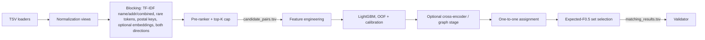

# Amazon ML Challenge 2026: Business Entity Resolution
## End-to-End Implementation Plan

**Window:** Fri 25 Sep 2026, 12:00 AM IST → Sun 27 Sep 2026, 11:59 PM IST
**Budget:** 5 leaderboard submissions/day × 3 days = **15 total** (treat each one as precious)
**Metric:** Macro-averaged F0.5 per Source 1 entity, singletons included

---

## 0. TL;DR: The Plan in One Screen

1. **Load data safely** (tab-separated, no quoting, no NaN coercion) and build an **exact local scorer** before anything else.
2. **EDA** to confirm structural facts that drive precision: is each S2/S3 record matched to at most one S1? Do matches always share a country? What fraction of S1 entities are singletons?
3. **Normalize** names and addresses with country-agnostic rules (accent stripping, abbreviation expansion, legal-suffix separation, number extraction). France is unseen, so nothing may depend on `country ∈ {US, India}`.
4. **Block** with a union of cheap retrievers (char n-gram TF-IDF on name, on address, on name+address, rare-token inverted index, optional multilingual embeddings), done **both directions** (S1→S2/S3 and S2/S3→S1), capped to top-K per S1. Measure the recall ceiling.
5. **Pairwise model:** LightGBM on ~60–100 similarity features, including **rank / reverse-rank / gap features**, which are the most powerful and the most robust to the France shift.
6. **Post-process for the metric:** calibrate → enforce one-to-one assignment (if EDA confirms) → choose each S1's output set by **maximizing expected F0.5**, including the option of predicting empty.
7. **Validate** with GroupKFold on S1 entities **plus** cross-country holdout (train US → test India, and the reverse) as a proxy for France.
8. **Ship** `matching_results.tsv` + `candidate_pairs.tsv`, run the validator, then package code, README, requirements, and the methodology document.

---

## 1. Rules & Constraints Digest (What Can Get You Disqualified or Rejected)

### 1.1 Hard rules (fair play)
| Rule | What it means for the pipeline |
|---|---|
| No external databases, APIs, or services to look up businesses | No web search, no business registries, no commercial ER APIs |
| No geocoding APIs | Address normalization must be purely string/regex/model based |
| No external data augmentation from the internet | Train only on the provided data; pretrained model weights are implicitly allowed (see license rule) |
| Final model must be **MIT or Apache 2.0** and **≤ 8B parameters** | Keep a license table of every pretrained model used; verify each model card yourself |
| One login per participant, desktop/laptop only | Don't share accounts; don't submit from phones |
| No multiple IDs per participant | — |
| All code and pipelines will be reviewed | Make every step reproducible and deterministic (fixed seeds) |

**Gray areas to clarify via the official Google Form early on Day 1:**
- Hand-written abbreviation / legal-suffix dictionaries (e.g., `rd→road`, `SARL`, `Pvt`). This is domain knowledge, not data lookup, but get it confirmed in writing.
- Transductive use of the **unlabeled test data** (fitting TF-IDF/IDF on test records, pseudo-labeling France). This is standard practice and uses no external data, but confirm.

### 1.2 Submission format rules (rejection = wasted submission)
- Tab-separated, exact headers: `source1_entity_id`, `matched_entity_ids` (and `candidate_entity_ids` for the candidates file).
- **Exactly one row per test S1 entity**, including France and singletons.
- Empty list for singletons (empty string, not `NaN`, not `[]`, not `""`).
- Only S2-/S3- IDs that exist in the **test** set. No S1 IDs, no duplicates within a list, no duplicate rows.
- Every matched ID must also appear in `candidate_pairs.tsv` (matches ⊆ candidates).
- `candidate_pairs.tsv` = the **final** candidate set the model actually scores, not an earlier, larger blocking pass.
- Always run `python3 utils/validate_submission.py --matching ... --candidate ... --test-dir dataset/test` before uploading.

### 1.3 Deliverables
- Leaderboard: `matching_results.tsv` uploaded on the Portal.
- Final zip: `<team_name>_submission.zip` with `output/`, `code/business_entity_resolution/{src/, README.md, requirements.txt}`, and the filled `Documentation_template.md`.
- Note the mismatch: the general guidelines mention a **1–2 page document**, while the problem statement says the template has **no page limit**. Plan: fill the template thoroughly, and open it with a 1–2 page executive summary so both requirements are satisfied.
- Keep a **version history** of every submission (file + git commit + CV score).

---

## 2. Understanding the Metric Deeply (This Drives Every Decision)

Per S1 entity, with prediction set `P` and truth set `T`:

| Case | Score |
|---|---|
| `T = ∅`, `P = ∅` | **1.0** |
| `T = ∅`, `P ≠ ∅` | **0.0** |
| `T ≠ ∅`, `P = ∅` | **0.0** (precision undefined → treated as 0; assume this) |
| Otherwise | `1.25·p·r / (0.25·p + r)` |

### 2.1 Key consequences
1. **The empty-vs-non-empty decision is roughly symmetric**, not "be super conservative". Predicting empty earns P(singleton). Predicting only the top-1 candidate earns P(non-singleton and top-1 correct) × F(1 of n). For a 1-match entity that's F = 1.0. So the threshold for including the first candidate is around 0.5 (calibrated), not 0.9.
2. **Partial recall is cheap, false positives are expensive.** If an entity has 2 true matches:
   - Predict 1 correct → F = 0.833
   - Predict 2 correct → F = 1.0
   - Predict 1 correct + 1 wrong (n=1 truth) → F = 0.556
   So adding the 2nd/3rd candidate needs a much higher bar than adding the 1st.
3. **Trivial baseline** (predict everything empty) scores exactly the **singleton fraction**. Compute this on train; it's the floor every model must beat.
4. **Macro averaging** means every S1 entity counts equally. A small-business singleton counts as much as a chain with 10 matches.
5. Two thresholds (`t_first`, `t_additional`) or an expected-F optimizer (Section 8.3) will beat a single global pair threshold.

### 2.2 Local scorer (write this first, test it on the example in the statement: expect 0.714)
```python
def f05_entity(pred, true, beta=0.5):
    pred, true = set(pred), set(true)
    if not true and not pred:
        return 1.0
    if not true or not pred:
        return 0.0
    tp = len(pred & true)
    if tp == 0:
        return 0.0
    p, r = tp / len(pred), tp / len(true)
    b2 = beta * beta
    return (1 + b2) * p * r / (b2 * p + r)

def macro_f05(pred_map, true_map):
    # pred_map/true_map: dict S1_id -> list of ids; score over ALL S1 ids in true_map
    return sum(f05_entity(pred_map.get(k, []), v) for k, v in true_map.items()) / len(true_map)

assert abs(f05_entity(["S2-00047","S2-00193","S3-00812"], ["S2-00047","S3-00812"]) - 0.714) < 1e-3
```
Also report: pair precision/recall, singleton accuracy, score split by country, by source (S2 vs S3), and by number of true matches.

---

## 3. Data Loading (Avoid the Silent Bugs)

```python
import csv, pandas as pd

def read_tsv(path):
    return pd.read_csv(path, sep="\t", dtype=str, keep_default_na=False,
                       na_filter=False, quoting=csv.QUOTE_NONE, encoding="utf-8")

def parse_ids(s):
    return [x for x in s.split(",") if x] if s else []
```
- `quoting=csv.QUOTE_NONE` prevents business names containing `"` from swallowing lines.
- `na_filter=False` prevents names like `NA`, `NULL`, `None` becoming NaN.
- After loading, assert: row counts match `wc -l` minus header, IDs are unique, prefixes match the file.

Writing:
```python
def write_output(path, s1_ids, mapping, col):
    rows = [(i, ",".join(dict.fromkeys(mapping.get(i, [])))) for i in s1_ids]  # dedupe, keep order
    pd.DataFrame(rows, columns=["source1_entity_id", col]).to_csv(
        path, sep="\t", index=False, quoting=csv.QUOTE_NONE, escapechar="\\")
```

---

## 4. Day-1 EDA Checklist (Answer These Before Modeling)

| # | Question | Why it matters |
|---|---|---|
| 1 | Record counts per file and per country (train and test) | Sizing the blocking; France share of test |
| 2 | Distribution of number of matches per S1; singleton fraction | Trivial baseline; how often to predict empty |
| 3 | **Does any S2/S3 ID appear in more than one GT list?** | If never → one-to-one assignment constraint is a huge precision lever |
| 4 | What fraction of S2/S3 records match no S1 at all? | Distractor density; the rate of "orphan" records |
| 5 | Do matched pairs always share the same `country` value? | If yes → country is a safe hard block |
| 6 | Match counts split S2 vs S3; noise patterns per source | Source-specific features; S2/S3 may be noisy in different ways |
| 7 | Are there duplicate records within S2 (or S3) for the same S1? | Explains one-to-many; enables S2↔S3 / S2↔S2 graph features |
| 8 | Missing/empty rates for name and address per source/country | Tri-state features (match / conflict / missing) |
| 9 | Top frequent name tokens per country (chains, "Sri", "Enterprises", "Store") | Low-IDF tokens; chain detection |
| 10 | Postal codes: presence rate, formats (India 6-digit PIN, US 5/9-digit ZIP) | Very strong exact-match features |
| 11 | Manually read ~50 positive pairs and ~50 hard negatives | Discover the actual noise; tune normalization |
| 12 | Script/charset check: any Devanagari or non-Latin text? Accents? | Transliteration handling; France will have accents |
| 13 | Compare test vs train statistics (lengths, token overlap, country mix) | Anticipate distribution shift |
| 14 | Do IDs correlate with matches (ordering leakage)? | Check only to make sure you **don't** accidentally rely on it; test is likely shuffled and exploiting it is unsafe |

Write the findings into a `notes/eda.md`. They become the "data insights" section of the documentation.

---

## 5. Normalization Layer

Produce, for every record, multiple views so later stages can pick the right one.

### 5.1 Generic (country-agnostic) text cleaning
1. Unicode NFKC, then NFKD + strip combining marks (`é→e`, `ç→c`) — **critical for France**.
2. Lowercase, `&` → ` and ` (also `et` for French, as a token synonym rather than a rewrite), remove punctuation except digits/letters/`/`/`-` in addresses.
3. Collapse whitespace; separate digit-letter joins (`12a` → `12 a` in one view, keep original in another).

### 5.2 Name views
| View | Description |
|---|---|
| `name_clean` | Cleaned full name |
| `name_core` | Legal suffixes/forms removed: `inc, llc, ltd, limited, corp, corporation, co, company, pvt, private, plc, llp, lp, pllc, gmbh, sa, sas, sarl, eurl, sci, snc, ste, societe, ets, etablissements` |
| `legal_form` | The canonical legal suffix found (for a match/conflict feature) |
| `name_tokens_sorted` | Sorted tokens (handles word-order transpositions) |
| `acronym` | First letters of core tokens (`international business machines` → `ibm`) |
| `phonetic` | Double Metaphone per token (handles `lakshmi/laxmi`, `shri/sri/shree` partially) |
| `dba_split` | If `dba`, `d/b/a`, `t/a`, `trading as`, `aka`, `(…)` present → split into two names; compare against both |

Plus a small synonym map for very common transliteration variants (`sri/shri/shree/shri`, `mohd/mohammed/muhammad`, `enterprise/enterprises`, `&/and`) applied only to token comparison, not destructively.

**Data-driven abbreviation mining (recommended):** from training positive pairs, align tokens between names/addresses and count `(token_a, token_b)` pairs where one is a prefix/abbreviation of the other (`rd`↔`road`, `mkt`↔`market`, `hosp`↔`hospital`). Keep pairs with enough support. Fit this **inside each CV fold** to avoid leakage.

### 5.3 Address views
| View | Description |
|---|---|
| `addr_clean` | Cleaned, abbreviations expanded (`rd→road, st→street, ave/av→avenue, blvd/bd→boulevard, ln→lane, dr→drive, apt, ste→suite, fl→floor, opp→opposite, nr→near, bldg→building, mkt→market`) |
| `postal` | Extracted postal code: 6-digit (India PIN), 5 or 5+4 digit (US ZIP), 5-digit (France) — use a generic "5–6 digit standalone number near end" rule, not country-specific code |
| `numbers` | Set of all numeric tokens (house number, plot, shop, sector, floor); also normalized forms of `12/3a`, `#45`, `no. 12`, `plot no 12` → `12` |
| `landmark` | Phrases after `near/opp/opposite/behind/beside/next to/pres de/en face` separated out |
| `addr_no_landmark` | Address with landmark phrase removed |
| `city/state tokens` | Last 1–3 non-numeric tokens heuristically; US state abbreviation↔name map |

**Caution with `st`:** `st` = `street` (US) but `saint` (France, `st denis`). Resolve by position (before a name = saint, after a name = street) or keep both expansions as alternative tokens. Char n-gram similarity is robust to this anyway.

### 5.4 France strategy (unseen country)
- Nothing in the pipeline may branch on `country == "US"` or `"India"`. Country only acts as a string for blocking equality and for per-country IDF statistics.
- Accent stripping + French abbreviation entries (`av, bd, r, pl, fbg, chem, imp, all`) + legal forms (`sarl, sas, sasu, eurl, sa, sci, snc, ste`) handle most French noise.
- Prefer **relative** features (rank, gap, reverse-rank) and **character n-gram** similarities over word-dictionary features; they transfer across languages.
- Fit TF-IDF/IDF on the **test** corpus at inference (per country), so French token rarity is learned from French data.

---

## 6. Blocking / Candidate Generation

Goal: maximize **recall of true pairs** at a manageable K, because blocking caps the recall.

### 6.1 Blocking keys & retrievers (take the union)
| Retriever | Details | Catches |
|---|---|---|
| R1: Name char n-gram TF-IDF | `char_wb`, n=2–4 or 3–5, sublinear TF, on `name_core`; top-K cosine | Typos, abbreviations, suffix variants |
| R2: Address char n-gram TF-IDF | On `addr_no_landmark`; top-K | Chains' branches, renamed businesses |
| R3: Name+address combined TF-IDF | Concatenated string; top-K | Balanced cases |
| R4: Word-level TF-IDF (IDF-weighted) | On name tokens incl. phonetic codes | Word reordering, transliterations |
| R5: Rare-token inverted index | Any shared name token with document frequency below a cutoff | Distinctive names with heavy address noise |
| R6: Postal code + first name token | Exact key join | Cheap, very precise |
| R7 (optional): Multilingual embedding ANN | e.g., `multilingual-e5-small` (MIT) or `paraphrase-multilingual-MiniLM-L12-v2` (Apache 2.0), FAISS top-K | Semantic variants, French robustness |

Block within the same `country` string **only if EDA #5 confirms** matches never cross countries; otherwise use country as a feature.

**Run retrieval in both directions:** S1→(S2∪S3) top-K, and each S2/S3 record→S1 top-K′ (reverse). Reverse retrieval improves recall for S2/S3 records whose best S1 is not in that S1's top-K, and powers reverse-rank features.

### 6.2 Efficient top-K for sparse TF-IDF
```python
import numpy as np

def topk_sparse(A, B, k, chunk=1000):
    """A: (n,d), B: (m,d) L2-normalized CSR. Returns (idx, sims) of shape (n,k)."""
    BT = B.T.tocsr()
    k = min(k, B.shape[0])
    all_idx, all_sim = [], []
    for s in range(0, A.shape[0], chunk):
        S = (A[s:s+chunk] @ BT).toarray()          # chunk x m dense; lower chunk if m is large
        idx = np.argpartition(-S, k - 1, axis=1)[:, :k]
        sim = np.take_along_axis(S, idx, axis=1)
        order = np.argsort(-sim, axis=1)
        all_idx.append(np.take_along_axis(idx, order, 1))
        all_sim.append(np.take_along_axis(sim, order, 1))
    return np.vstack(all_idx), np.vstack(all_sim)
```
For large pools, use `sparse_dot_topn` (verify its license) or split by country first. Memory ≈ `chunk × m × 8` bytes.

### 6.3 Final candidate cap
1. Union all retrievers → candidate pool per S1 (with each retriever's score as a feature).
2. Score with a cheap pre-ranker (max of retriever scores, or a tiny LightGBM on 5–10 cheap features).
3. Keep top **K_final** per S1 (tune: 10, 20, 30, 50) — this is exactly what goes into `candidate_pairs.tsv`.

### 6.4 Blocking metrics (report in documentation)
- **Pair recall** = true pairs in candidates / all true pairs
- **Entity full-recall** = fraction of non-singleton S1s whose entire truth set is in candidates
- **Reduction ratio** = 1 − |candidates| / (|S1| × |S2 ∪ S3|)
- **Recall@K curve** per retriever and for the union, per country and per source

Target: pair recall ≥ 97–99% at K_final ≤ 30. Blocking misses are recall you can never recover.

---

## 7. Pairwise Matching Model

### 7.1 Training data
- Run the **same** blocking on train → candidate pairs; label = 1 if the pair is in ground truth, else 0.
- These are naturally **hard negatives** (they look similar), which is what the model needs.
- Don't inject GT positives that blocking missed (it distorts the inference distribution); optionally test it with low weight.
- **CV:** `GroupKFold(n=5)` grouped by S1 entity. Everything label-dependent (abbreviation mining, any target encoding) must be fit inside folds.

### 7.2 Feature set (~60–100 features)
**Name similarity (on `name_clean`, `name_core`, sorted tokens)**
- Levenshtein ratio, Jaro-Winkler, `token_set_ratio`, `token_sort_ratio`, `partial_ratio`, `WRatio` (rapidfuzz, MIT)
- Token Jaccard, char 3-gram Jaccard, TF-IDF cosine (char and word)
- Soft TF-IDF / IDF-weighted token overlap; Monge-Elkan with Jaro-Winkler inner
- Acronym match (either direction), first-token equal, last-token equal
- Phonetic token overlap
- Legal form: same / different / one missing (tri-state)
- Length ratio, token count diff, numbers in name equal/conflict
- Max IDF of shared tokens, sum IDF of unshared tokens (distinctive-token disagreement is a strong negative signal)
- DBA-aware: max similarity over split name variants

**Address similarity**
- Same string similarity suite on `addr_clean` and `addr_no_landmark`
- Postal code: equal / conflict / missing (tri-state), and prefix match (first 3 digits)
- Numeric token Jaccard; house-number equal / conflict / missing
- City/state token overlap; landmark text similarity
- Address length, missing-component flags for each side

**Retrieval and context features (usually the strongest)**
- Each retriever's score and rank for this pair; which retrievers found it
- Rank of this candidate among the S1's candidates (by name sim, address sim, combined)
- **Reverse rank:** rank of this S1 among all S1s competing for this S2/S3 record
- Gap to the best candidate's score; gap to the 2nd best S1 for this candidate
- Number of candidates above various similarity levels for this S1
- Name frequency: how many S1 records share this `name_core` (chain signal: same name, many places → address must decide)

**Source & embedding**
- `is_S3` flag (S2 vs S3 noise may differ)
- Embedding cosine for name, address, combined (if R7 used)
- Cross-encoder score (optional stage, Section 7.4)

**Country:** do not one-hot. If used at all, only derived country-agnostic statistics (e.g., postal-code presence rate in that country).

### 7.3 Model
- **LightGBM** (MIT) binary classifier. Starting params: `num_leaves=63, learning_rate=0.05, n_estimators≈2000 with early stopping, min_child_samples=50, feature_fraction=0.8, bagging_fraction=0.8, lambda_l2=1`. Seeds fixed.
- Optional ensemble: XGBoost (Apache 2.0) / CatBoost (Apache 2.0), averaged ranks or probabilities.
- Save **out-of-fold (OOF) predictions** for every training pair; all post-processing is tuned on OOF.
- **Calibrate** with isotonic regression on OOF (needed for the expected-F step).

### 7.4 Optional stage: cross-encoder re-ranker (only if Day 2 goes well and a GPU is available)
- Model: `xlm-roberta-base` (MIT) or `microsoft/mdeberta-v3-base` (MIT), both far below 8B and multilingual (helps France).
- Input: `"{name1} | {addr1}"` vs `"{name2} | {addr2}"`, binary classification on blocked pairs, 1–2 epochs, max_len 128.
- Produce OOF scores with 3-fold training (grouped by S1) and feed them as a feature to LightGBM.
- Budget roughly 3–5 GPU hours; skip if the GBM already saturates.
- An LLM (≤ 8B, MIT/Apache) is **not recommended** within 3 days; latency and risk are high relative to the gain.

### 7.5 Second-stage graph features (optional, cheap, often +1–2 points)
Using first-stage OOF probabilities:
- For candidate `y` of S1 `a`: max over other candidates `x` of `a` of `p(a,x) × sim(x,y)` (S2↔S3 transitivity).
- Number of other S1s where this candidate has p > 0.5.
- Train a second LightGBM on original + these features (again OOF).

---

## 8. Post-Processing Tuned to F0.5

### 8.1 One-to-one assignment (only if EDA #3 confirms)
Each S2/S3 record belongs to at most one S1. Keep each candidate only for the S1 with the highest probability; drop or down-weight it elsewhere:
```python
best = pairs.loc[pairs.groupby("cand_id")["prob"].idxmax(), ["cand_id", "s1_id"]]
pairs = pairs.merge(best, on=["cand_id", "s1_id"], how="inner")
```
If a candidate is nearly tied between two S1s (duplicates within S1 shouldn't exist, but near-identical chain branches do), consider dropping it from both unless address clearly wins. Re-calibrate after this step.

### 8.2 Simple rule (baseline): two thresholds
For each S1: sort candidates by probability; include the first if `p1 ≥ t_first`; include each additional one if `p ≥ t_add`. Grid-search `(t_first, t_add)` on OOF against the exact macro-F0.5. Expect `t_first` around 0.4–0.6 and `t_add` noticeably higher.

### 8.3 Better rule: expected-F0.5 maximization per S1
```python
def best_prefix(probs, p_miss=0.0, n_sim=4000, rng=np.random.default_rng(0)):
    """probs sorted desc (calibrated). p_miss = prob a true match exists outside candidates.
    Returns k = number of top candidates to output (0 = empty)."""
    m = len(probs)
    if m == 0:
        return 0
    T = rng.random((n_sim, m)) < probs                     # sampled truth
    n_true = T.sum(1) + (rng.random(n_sim) < p_miss)
    best_k, best_val = 0, (n_true == 0).mean()            # value of predicting empty
    tp_cum = np.cumsum(T, axis=1)
    for k in range(1, m + 1):
        tp = tp_cum[:, k - 1]
        p = tp / k
        r = np.divide(tp, n_true, out=np.zeros_like(p, dtype=float), where=n_true > 0)
        den = 0.25 * p + r
        f = np.divide(1.25 * p * r, den, out=np.zeros_like(p, dtype=float), where=den > 0)
        if f.mean() > best_val:
            best_k, best_val = k, f.mean()
    return best_k
```
- Limit to the top ~10 candidates for speed.
- Estimate `p_miss` from blocking recall on train (per retriever mix).
- Probabilities aren't truly independent; compare OOF score against 8.2 and keep whichever wins.

### 8.4 Entity-level singleton model (optional)
A small classifier per S1 predicting "has ≥ 1 match" from aggregate features (max prob, 2nd prob, gap, count above 0.3/0.5/0.7, name frequency, number of candidates). Use its output to override or blend the empty decision. Useful because the empty decision carries ~full weight for a large share of entities.

---

## 9. Validation Protocol

1. **GroupKFold (5) by S1 entity** on train: primary CV score. Keep the full S2/S3 pool as retrieval targets (distractors present, like test).
2. **Cross-country holdout** (France proxy): train on US → evaluate India; train on India → evaluate US. Use it to choose between feature sets: prefer the variant that holds up better across countries even if in-country CV is slightly lower.
3. **Per-country, per-source, per-match-count breakdowns** for every experiment.
4. **Shift monitoring on test:** compare, per country, the distribution of top-1 probability and the predicted singleton rate against train. If France's predicted singleton rate is far above the train rate, absolute similarity features are likely misfiring → lean on rank/gap features, or use pooled thresholds adjusted by rank.
5. **Adversarial validation (quick):** classify train-vs-test France candidate features; top discriminating features indicate what is shifting.
6. Track **CV vs public LB** for each submission; trust CV when they disagree (public LB is a subset; final ranking is private LB).

---

## 10. Optional France Robustness Boosters
- **Synthetic positives from test France records (self-supervised):** take French S1 records, apply the observed noise operations (abbreviate `avenue→av`, drop postal code, typos, word swaps, suffix changes) to create synthetic pairs; check the model scores them high. Use for sanity checks; use for training only after confirming it is allowed.
- **Pseudo-labeling:** add very high-confidence France predictions (p > 0.97, one-to-one consistent) as training pairs, retrain once. Confirm permissibility first.
- **Country-dropout training:** train with country-derived statistics randomly masked so the model doesn't lean on them.

---

## 11. Architecture Overview



---

## 12. Repository Layout

```
business_entity_resolution/
├── README.md
├── requirements.txt            # generate with `pip freeze` in the final env
├── configs/
│   └── default.yaml            # K values, thresholds, seeds, paths, feature toggles
├── src/
│   ├── io_utils.py             # safe TSV read/write, ID parsing
│   ├── normalize.py            # all text views, abbreviation maps, legal forms, postal/number extraction
│   ├── abbrev_mining.py        # data-driven token alignment from positives (fold-aware)
│   ├── blocking.py             # retrievers, both directions, union, pre-ranker, top-K cap
│   ├── features.py             # pairwise + rank/context features
│   ├── embeddings.py           # optional bi-encoder / cross-encoder
│   ├── train.py                # GroupKFold LightGBM, OOF, calibration, model saving
│   ├── postprocess.py          # one-to-one, thresholds, expected-F selection
│   ├── evaluate.py             # exact metric, breakdowns, blocking metrics
│   ├── predict.py              # test inference end-to-end
│   └── run_pipeline.py         # CLI: --stage {block,features,train,predict,all}
├── notebooks/                  # EDA only; never needed for reproduction
└── artifacts/                  # cached features/models (gitignored; regenerable)
```
Every function gets a docstring (the guidelines require commented source). Fix all seeds (`numpy`, `random`, LightGBM `seed`, torch). Log each run's config + CV score to `runs/<timestamp>.json`.

**README must include:** environment setup, hardware used, exact commands (`python -m src.run_pipeline --stage all --data dataset --out output`), expected runtime per stage, and how to run the validator.

---

## 13. Three-Day Timeline

### Day 1 — Fri 25 Sep: Foundations + first valid submissions
| Block | Task | Output |
|---|---|---|
| 1 | Read rules, send gray-area questions via Google Form, set up git + env | Repo skeleton |
| 2 | Loaders, exact scorer, run validator on a dummy all-empty file | Verified I/O |
| 3 | EDA checklist (Section 4) | `notes/eda.md` |
| 4 | Normalization v1 | `normalize.py` |
| 5 | Blocking v1: name + address char TF-IDF, recall@K curves | Blocking report |
| 6 | Rule baseline (name sim & address sim thresholds tuned on train) | **Sub 1** (format check + LB/CV sanity) |
| 7 | Features v1 + LightGBM v1 + two-threshold post-processing | **Sub 2** |

### Day 2 — Sat 26 Sep: Make it strong
| Block | Task | Output |
|---|---|---|
| 1 | Blocking v2: combined TF-IDF, rare-token index, postal keys, reverse direction, K tuning | Recall ≥ target |
| 2 | Features v2: rank/reverse-rank/gap, IDF-weighted, numeric/postal tri-state, chain frequency | CV jump |
| 3 | One-to-one assignment + calibration + expected-F selection | **Sub 3** |
| 4 | Cross-country holdout; prune features that don't transfer | France-robust variant |
| 5 | Optional embeddings retriever/feature; graph second stage | **Sub 4** |
| 6 | Start documentation draft while models train | Doc skeleton |
| 7 | Best CV variant | **Sub 5** |

### Day 3 — Sun 27 Sep: Robustness, ensemble, package
| Block | Task | Output |
|---|---|---|
| 1 | Optional cross-encoder feature (only if GPU + time) | Ablation result |
| 2 | Seed/model ensemble; final threshold tuning on OOF | **Sub 6–7** |
| 3 | France shift checks (Section 9.4); adjust if predicted singleton rate is off | **Sub 8** |
| 4 | Freeze code; clean end-to-end run from a fresh env reproduces outputs | Reproducibility proof |
| 5 | Final submission chosen by **CV + cross-country score**, not public LB alone | **Final sub** by early evening IST |
| 6 | Finish documentation, build the zip, verify structure | `<team>_submission.zip` |

Don't leave the final upload for the last hour; portal congestion is common.

### Submission log (keep this table updated)
| # | Date/time | Git commit | Change | CV F0.5 | Cross-country | Public LB | Notes |
|---|---|---|---|---|---|---|---|
| 1 | | | Rule baseline | | | | |

---

## 14. Documentation Template Mapping
| Required section | Content to write |
|---|---|
| Methodology | Problem framing, metric analysis (Section 2), overall pipeline diagram |
| Candidate generation / blocking | Retrievers, both-direction retrieval, K choice, recall@K curves, reduction ratio |
| Model architecture & features | Feature groups with rationale, LightGBM setup, calibration, optional cross-encoder, license table |
| Post-processing | One-to-one evidence from EDA, expected-F selection, threshold tuning |
| Validation | GroupKFold, cross-country holdout, CV vs LB table |
| Experiments & ablations | What helped / what didn't, with numbers |
| Generalization to France | Country-agnostic design choices, shift monitoring results |
| Fair play statement | No external data/APIs/geocoding; list of pretrained models + licenses; hand-built dictionaries disclosed |
| Reproducibility | Commands, hardware, runtime, seeds |

### Model/library license table (verify each on its official model card/repo)
| Component | License (as far as I know) | Params |
|---|---|---|
| LightGBM | MIT | — |
| XGBoost / CatBoost | Apache 2.0 | — |
| rapidfuzz | MIT | — |
| scikit-learn | BSD-3 (library, not a "model") | — |
| multilingual-e5-small | MIT | ~118M |
| paraphrase-multilingual-MiniLM-L12-v2 | Apache 2.0 | ~118M |
| xlm-roberta-base / mdeberta-v3-base | MIT | ~280M |

---

## 15. Risk Register
| Risk | Mitigation |
|---|---|
| Blocking OOM on large pools | Block per country, smaller chunks, sparse top-K library |
| France scores collapse (distribution shift) | Accent stripping, char n-grams, rank features, cross-country validation, shift monitoring |
| Overfitting public LB | Choose by CV + cross-country; public LB only as sanity |
| Format rejection | Safe writer, validator before every upload, matches ⊆ candidates assert |
| Leakage inflating CV | Fold-aware mining/encoding; group by S1 |
| Running out of time | Strict scope: cross-encoder and pseudo-labeling are optional |
| Rule ambiguity | Ask via Google Form early; disclose everything in the documentation |

---

## 16. Definition of Done
- [ ] Local scorer reproduces the statement example (0.714)
- [ ] Blocking pair recall measured and reported; K_final chosen
- [ ] OOF CV and cross-country scores logged for the final model
- [ ] `matching_results.tsv` has exactly one row per test S1 (France included), passes the validator
- [ ] `candidate_pairs.tsv` is the final scored set; matches ⊆ candidates
- [ ] Fresh-environment run regenerates both outputs
- [ ] README, pinned requirements, docstrings, license table complete
- [ ] Documentation filled; zip structure verified
- [ ] Submission log complete with version history
